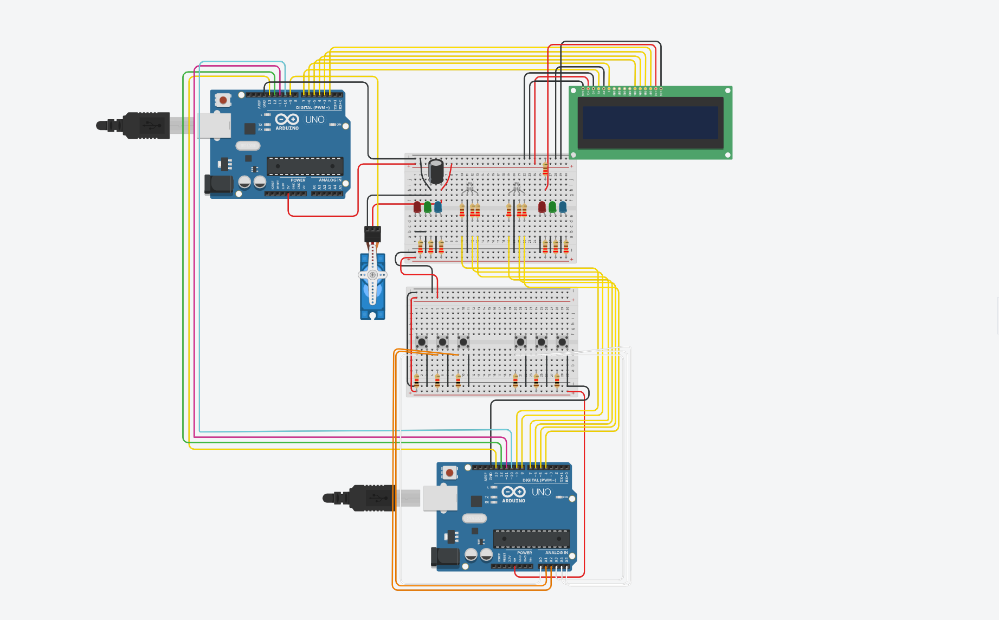
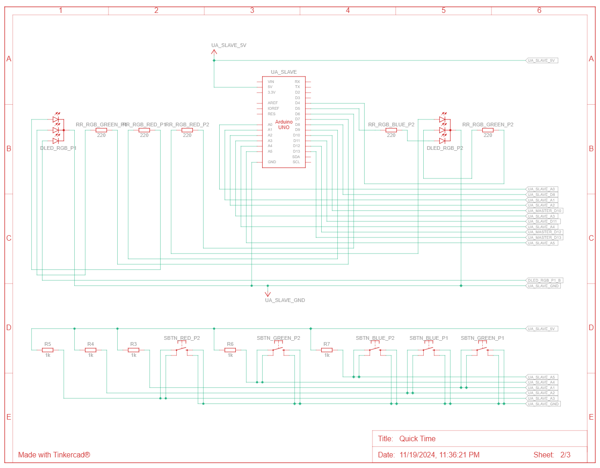
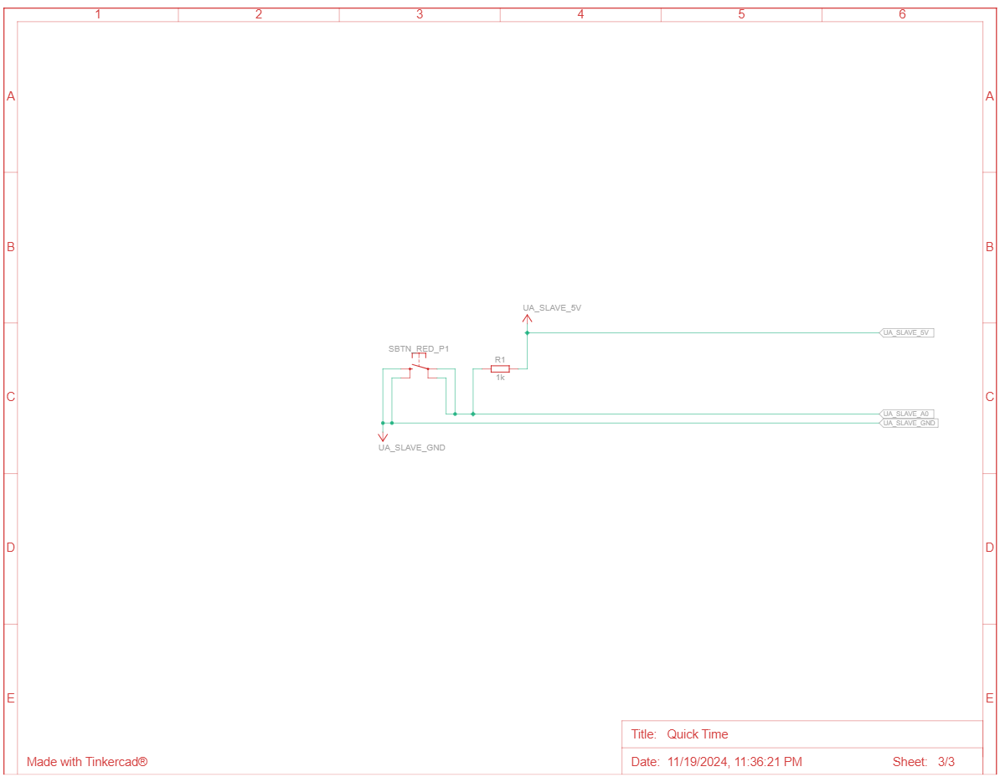
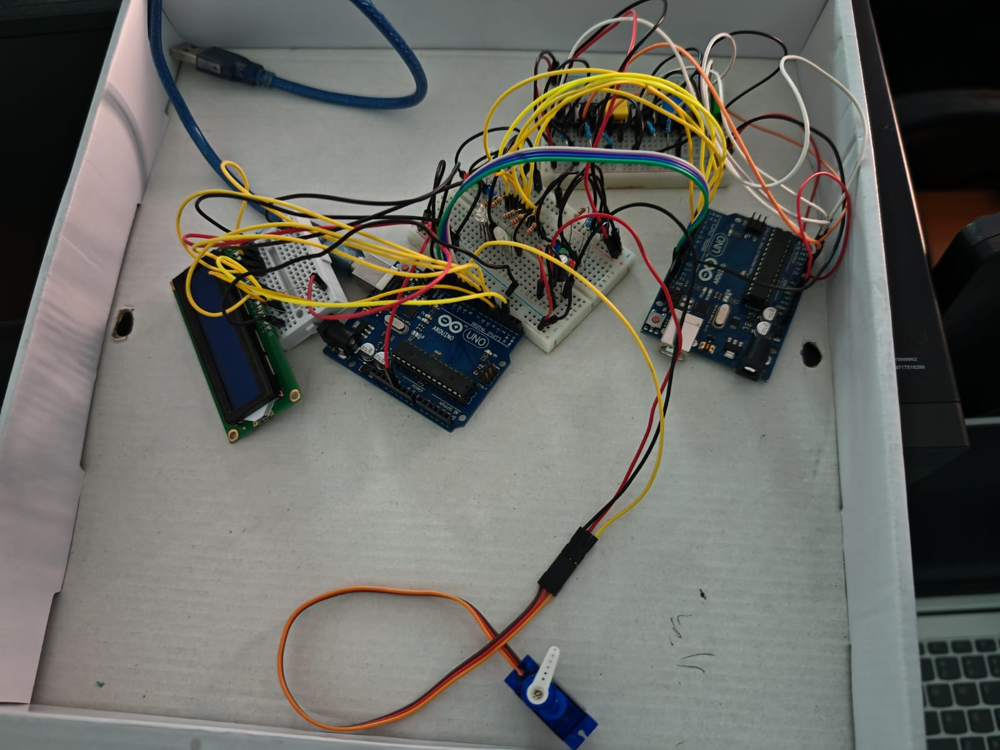

## Quicktime

### Descrierea Task-ului
#### Acest proiect implementeaza un joc de reflex pentru doi jucatori pe doua placi Arduino Uno, utilizand LED-uri RGB, butoane si un ecran LCD. Jucatorii concureaza pentru a apasa rapid butonul corect in functie de culoarea afisata pe LED-ul RGB al fiecaruia, iar scorurile sunt afisate in timp real pe LCD. Jocul se desfasoara pe runde, progresul fiind indicat de un servomotor, iar castigatorul este declarat la final.

### Componente utilizate

Componenta|Cantitate
---|---
Arduino UNO|2
Push Buttons|6
Condensator 100 $\mu\text{F}$|1
Servomotor|1
LCD 16x2|1
LED RGB|2
LED Rosu|2
LED Verde|2
LED Albastru|2  
Breadboard|3
Fire de legatura|

### Detalii Tehnice
- Proiectul utilizeaza doua placi Arduino Uno care comunica prin SPI pentru a gestiona toate componentele.
- Arduino-ul master controleaza LCD-ul, servomotorul si logica jocului (scoruri, starea rundelor, LED-urile active), iar Arduino-ul slave gestioneaza butoanele si LED-urile, transmitand inapoi actiunile jucatorilor. 
- Fiecare jucator dispune de trei butoane asociate unor LED-uri colorate si un LED RGB. LED-urile RGB afiseaza culori corespunzatoare, iar butoanele sunt utilizate pentru a obtine puncte in functie de viteza de reactie.
- LCD-ul afiseaza in timp real scorurile jucatorilor si mesajele corespunzatoare etapelor jocului. Un servomotor indica progresul jocului prin rotatii, marcand sfarsitul acestuia cand completeaza o rotatie completa. Iar pentru pentru controlul LCD-ului este folosita Biblioteca LiquidCrystal.
- Reglajele pentru punctaj, timpi intre runde si durata jocului sunt flexibile, permitand personalizarea dificultatii.

### Protocolul de comunicatie

#### Mesajele de la Master

Poll|Player|Unused|Led
---|---|---|---
0|0|0000|00

- Poll - Daca acest bit are valoarea 1, master-ul intreaba arduino-ul slave daca un buton a fost apasat.
- Player - Precizeaza jucatorul activ (0 fiind primul jucator, 1 fiind al doilea jucator).
- Unused - Biti disponibili pentru expansiuni viitoare.
- Led - Precizeaza culoarea LED-ului RGB care sa fie aprinsa:
  - 00 insemnand LED oprit
  - 01 insemnand rosu
  - 10 insemnand verde
  - 11 insemnand albastru


#### Mesajele de la Slave

Unused|Pressed
---|---
000000|00

- Pressed: Precizeaza butonul care a fost apasat:
  - 00 insemnand ca niciun buton nu a fost apasat inca.
  - 01 insemnand ca butonul corespunzator LED-ului rosu a fost apasat.
  - 10 insemnand ca butonul corespunzator LED-ului verde a fost apasat.
  - 11 insemnand ca butonul corespunzator LED-ului albastru a fost apasat.

 
#### Exemplu de comunicare:

```
Master: 00000011 // A inceput o runda noua, este randul primului jucator, LED-ul corect este albastru.
Slave : 00000011 // Raspunde cu acelasi mesaj, sa confirme ca a inteles.
Master: 10000000 // Polling.
Slave : 00000000 // Momentan jucatorul nu a apasat niciun buton.
Master: 10000000 // Polling iar.
Slave : 00000000 // Samd.
// Repetam secventa pana jucatorul apasa pe buton...
Master: 10000000
Slave : 00000011 // Jucatorul a apasat pe butonul corespunzator LED-ului albastru.
Master: 00000000 // Oprim LED-ul, runda s-a terminat.
Slave : 00000000 
// Nimic nu se transmite pana la inceputul rundei urmatoare...
Master: 01000010 // Este randul celui de-al doilea jucator si LED-ul corect este verde.
```

#### Pornirea jocului

Deoarece arduino-ul slave accepta apasari din partea ambilor jucatori cand LED-ul este oprit, dupa ce jocul s-a terminat putem da poll constant pentru a astepta inceperea jocului urmator.

```
Master: 00000000 // Jocul s-a terminat, inchidem LED-urile.
Slave: 00000000 // Looping back.
Master: 10000000 // Polling.
Slave : 00000000
// Repetam pana unul dintre butoane este apasat...
Master: 10000000
Slave: 00000010 // Unul dintre jucatori a apasat butonul corespunzator LED-ului verde. Putem incepe jocul.
// Asteptam inceperea jocului...
Master: 00000001 // A inceput prima runda, este randul primului jucator si LED-ul corect este cel rosu. 
```

### Flow  
---
#### Initializare  
1. Jocul incepe prin afisarea unui mesaj de bun venit pe LCD.  
2. Apasarea unui buton declanseaza startul jocului.  

#### Inceperea jocului:  
- **Apasarea oricarui buton:** Jocul porneste la apasarea oricarui dintre butoanele disponibile.  
---

#### Desfasurarea Rundelor  
1. Fiecare jucator are:  
   - **3 butoane**, fiecare asociat unui LED de culoare diferita.  
   - **1 LED RGB**, utilizat pentru a indica starea rundelor.  

2. La fiecare runda:  
   - Un singur jucator este **activ**.  
   - LED-ul RGB al jucatorului activ se aprinde intr-o culoare ce corespunde unui dintre butoanele sale.  
   - Jucatorul activ trebuie sa apese butonul corect cat mai rapid pentru a castiga puncte.  
   - Scorul este proportional cu viteza de reactie: raspuns mai rapid = punctaj mai mare.  

3. Dupa fiecare runda:  
   - **LCD-ul afiseaza scorul actualizat** al ambilor jucatori.  

4. Pe tot parcursul jocului:  
   - **LCD-ul afiseaza punctajele curente** ale jucatorilor.  

---

#### Timpul si Finalizarea Jocului  
1. **Progresul jocului** este indicat de rotatia unui **servomotor**.  
   - Servomotorul se roteste continuu la terminarea fiecarei mutari. 
   - $Increment pe runda = \dfrac{SERVO\\_MAX\\_DEG}{MAX\\_ROUNDS} = \dfrac{180^\circ}{24} = 7.5^\circ$

   - O **rotatie completa** marcheaza **sfarsitul jocului**.  

2. La finalul jocului:  
   - **LCD-ul afiseaza:**  
     - Numele castigatorului.  
     - Scorurile finale.  
   - Dupa cateva secunde, jocul revine la **ecranul de start** cu mesajul de bun venit.  

--- 
### Schema electrica in thinkercad
 
 
 
 
 



https://github.com/user-attachments/assets/92cd4f70-3a0e-43b5-b84f-46c3a81a70ba


